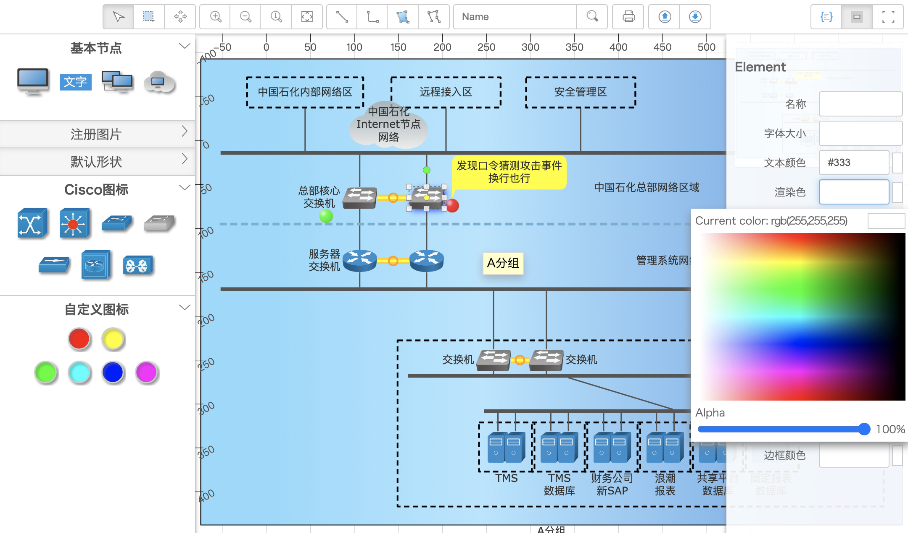

# graph.editor

~~老版本地址：https://github.com/samsha/graph.editor~~

本项目则基于Qunee for HTML5图形组件，是Qunee的扩展项目，新版本使用es6语法开发，删除了第三方组件的依赖

本项目本身是一个vue项目，但没有vue也可以正常使用

在线示例：[http://demo.qunee.com/editor/](http://demo.qunee.com/editor/)

开发方式说明

1，es6开发，无需安装vue环境，支持chrome，safari，firefox，edge等支持es6的浏览器

直接部署访问 src/index_es6.html

2，vue开发，需要安装vue环境，参照vue项目的部署方式进行

